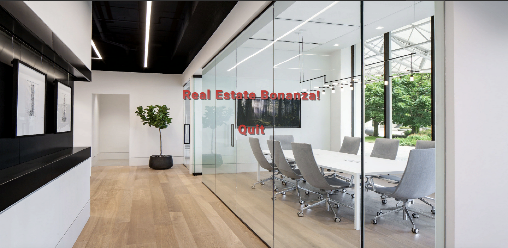
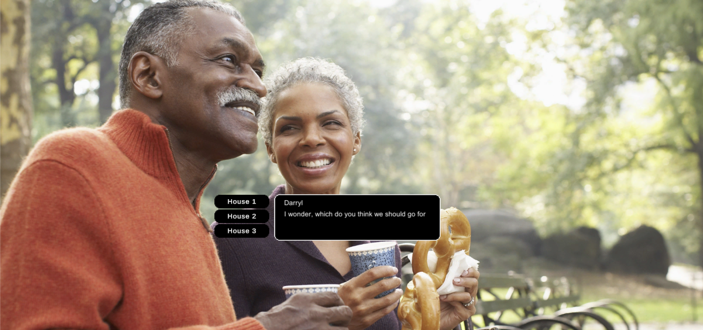

# Real Estate Bonanza
## Osman Abdalle
Play here at this link: https://play.unity.com/mg/other/real-estate-bonanza

## Overview
Delivered with C# and Unity, play as Reginald as he chases his goal to purchasing a Roadster! Accomplish this by being an awesome real estate agent and connect your clients with their dream home!

## Gameplay

Using hints and clues, pick up on which house the client would like best! There will be choices that pop up to the side of the dialogue box in which the user can press on to confirm their decisions. 

## Screenshots
### Main Menu

### Hints

### Choices
